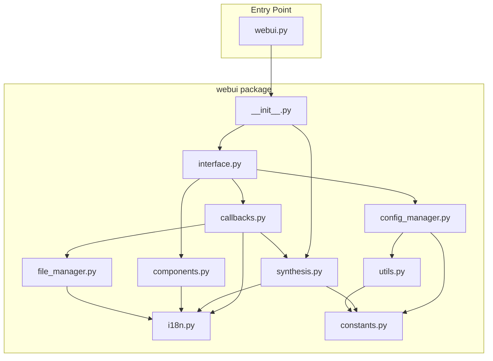

# 重构 webui.py 为模块化包

## 目标结构

```
webui/
├── __init__.py           # 导出核心接口
├── constants.py          # 常量、示例数据、方言配置
├── i18n.py               # 国际化字典和函数
├── utils.py              # 工具函数（类型转换、文本验证）
├── synthesis.py          # 合成核心逻辑
├── file_manager.py       # 文件保存、ZIP 创建
├── config_manager.py     # 配置导入/导出
├── components.py         # UI 组件创建
├── callbacks.py          # UI 回调函数（说话人管理、语言切换等）
└── interface.py          # render_interface 主函数

webui.py                  # 入口文件（保持兼容）
```

## 模块划分详情

### 1. `webui/constants.py`

- `BASE_DIR`, `CONFIG_DIR`, `MAX_SPEAKERS`, `MAX_TEXT_INPUTS`
- `S1_PROMPT_WAV`, `S2_PROMPT_WAV`
- `EXAMPLES_LIST`（第130-178行）
- `load_dialect_prompt_data()` 及 `DIALECT_PROMPT_DATA`, `DIALECT_CHOICES`

### 2. `webui/i18n.py`

- `_i18n_key2lang_dict`（约240行的翻译字典）
- `global_lang` 变量
- `i18n()` 函数
- `get_select_speaker_label()` 函数

### 3. `webui/utils.py`

- `_ensure_config_dir()`, `_list_config_files()`
- `_read_json_file()`, `_write_json_file()`
- `_coerce_gradio_file_to_path()`, `_coerce_audio_value_to_path()`
- `check_monologue_text()`, `check_dialect_prompt_text()`, `check_dialogue_text()`

### 4. `webui/synthesis.py`

- 全局变量 `model`, `dataset`
- `initiate_model()` 函数
- `process_single()` 函数
- `dialogue_synthesis_function()` 函数（核心合成逻辑，约280行）

### 5. `webui/file_manager.py`

- `create_zip_file()` 函数
- `create_all_zip()` 函数

### 6. `webui/config_manager.py`

- `_build_current_config_dict()` 函数
- `_export_current_config()` 函数
- `_refresh_config_dropdown()` 函数
- `_apply_loaded_config()` 函数
- `_load_uploaded_and_apply()` 函数
- `_load_selected_and_apply()` 函数

### 7. `webui/components.py`

- `create_speaker_group()` 函数
- `update_example_choices()`, `update_prompt_text()` 函数

### 8. `webui/callbacks.py`

- `update_speakers_visibility()` 函数
- `add_speaker()`, `quick_add_speakers()` 函数
- `batch_delete_speakers()` 函数
- `select_all_checkboxes()`, `select_none_checkboxes()` 函数
- `update_text_inputs_visibility()` 函数
- `process_single_synthesis()` 函数
- `collect_and_synthesize_queue()` 函数
- `_change_component_language()` 函数

### 9. `webui/interface.py`

- `render_interface()` 函数：仅保留 UI 布局定义，回调逻辑引用 `callbacks` 模块

### 10. `webui/__init__.py`

```python
from .interface import render_interface
from .synthesis import initiate_model
from .constants import BASE_DIR, CONFIG_DIR
```

### 11. `webui.py`（入口文件）

```python
from webui import render_interface, initiate_model
from webui.constants import ...
# 保持原有 get_args() 和 main 逻辑
```

## 模块依赖关系



## 实施步骤

1. 创建 `webui/` 目录结构
2. 按依赖顺序创建模块（constants -> i18n -> utils -> 其他）
3. 迁移代码到各模块，调整 import 语句
4. 重构 `render_interface()`，将回调函数移至 `callbacks.py`
5. 更新 `webui.py` 为简洁入口
6. 验证功能正常